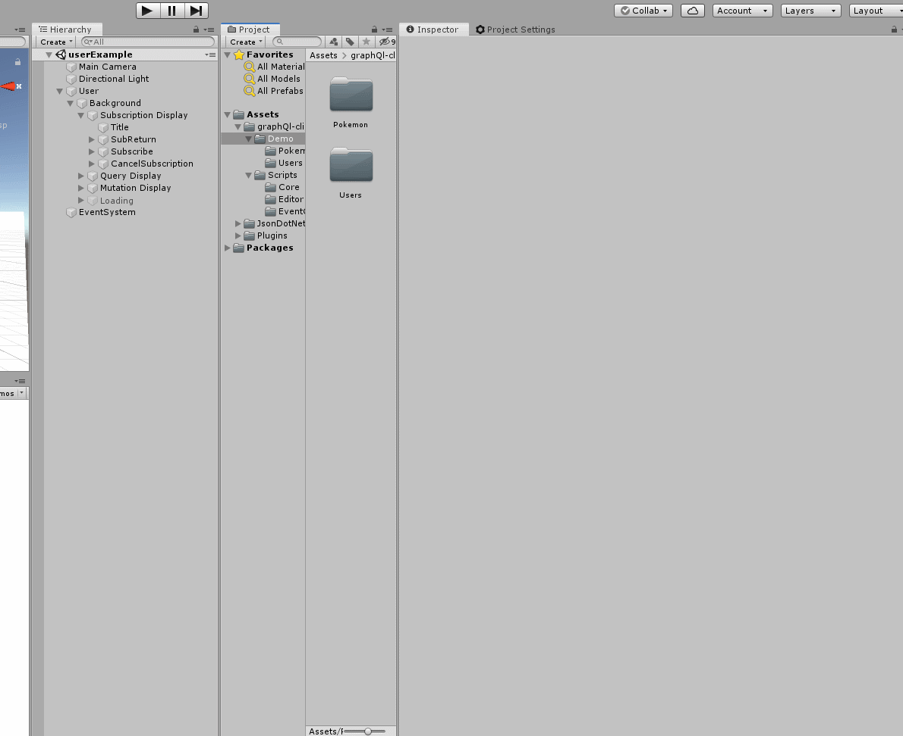
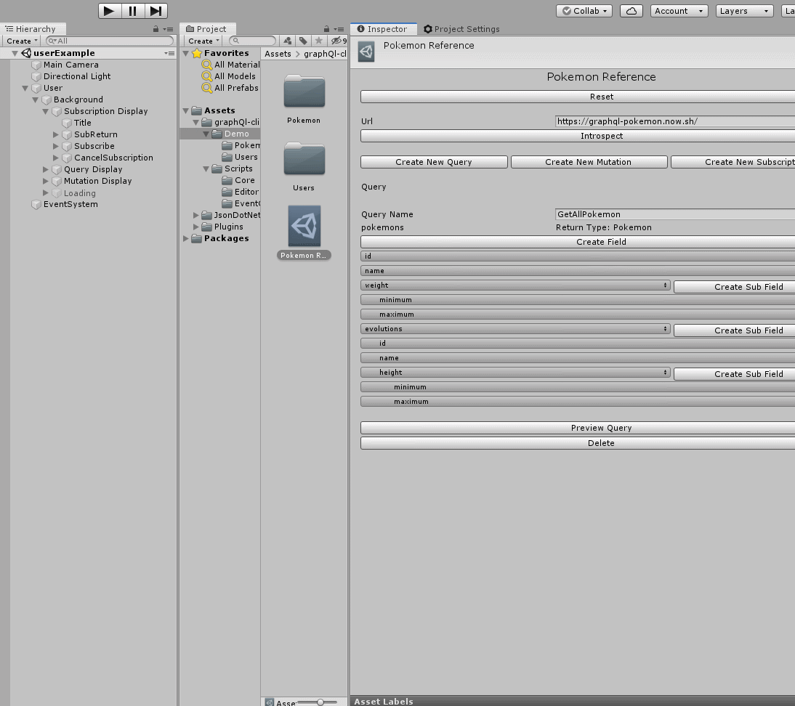

# graphQL-client-unity
graphQL-client-unity is, as the name implies, a graphQl client for the Unity game engine. Its major aim is to simplify the creation of graphQl queries and make graphQl features like subscriptions as straightforward as possible.

## How it works
When imported, graphQl-client-unity allows the creation of queries within the Unity Editor. The client utilizes one of graphQl's amazing features, [**Introspection**](https://graphql.org/learn/introspection/), to get all the queries, mutations, subscriptions, types and arguments from the graphQl schema. With this information, an easy-to-use editor layout allows the user to create queries by simply selecting from the available options within the editor. Each query created is stored in a scriptable object and can be used as many times as needed by simple calling one line of code.
```C#
UnityWebRequest request = await exampleApi.Post("QueryName", GraphApi.Query.Type.Query);
```
The client also utilizes different Events that can be subscribed to by any function. The Events are called when a request is completed, when data is gotten from a subscription and other useful cases.

## How to use
### Import UnityPackage
Download the [unitypackage](UnityPackages) file and import it into your Unity project.

### Create an API Reference
An API reference is a [Scriptable Object](https://docs.unity3d.com/Manual/class-ScriptableObject.html) that stores all the data relating to an API. For instance, if the API we intend to query is the [Pokemon GraphQl API](https://graphql-pokemon.now.sh/), within Unity, we would create an API Reference and point it to the url of the Pokemon GraphQl API. This API Reference will contain all the queries, mutations and subscriptions we wish to make pertaining to the Pokemon GraphQl API.

To create an API Reference, simply right click in your Asset folder, go to Create -> GraphQLClient -> API Reference. This would automatically create a new API Reference. Name it appropriately, put the url endpoint of the GraphQl API and click **Introspect** to  begin creating queries.

**Note**: You'll need to **Introspect** every time to make changes to your GraphQl API to fetch the current schema.



### Create a Query, Mutation or Subscription
To create a query, mutation or subscription is very intuitive and the processes are the same. Simply select Create Query (or Mutation, Subscription depending on your goal). Give the Query a name and pick the query from the dropdown menu displayed. After selecting the query you want to create, click confirm query and you can begin adding fields and subfields to the query. When you create a Query within the Editor, a Query object is created in the API Reference and this object houses all the information about that particular query.


### Preview a Query
You can preview a query created to see how it looks as text. This is done simply by clicking the Preview Query button at the bottom of the query. Use the Edit Query button to go back to editing the query



### Using the API Reference
To use an API reference to actually query APIs, you need to reference it within a script
```C#
using GraphQlClient.Core;

public GraphApi pokemonReference;
```
This allows you to drag and drop the API reference into the public field created in the Inspector. With the reference, you can query the API easily using the ``Post`` function

```C#
public async void GetPokemons(){
	UnityWebRequest request = await pokemonReference.Post("GetAllPokemons", GraphApi.Query.Type.Query);
}
```
The Post function returns a [UnityWebRequest object](https://docs.unity3d.com/ScriptReference/Networking.UnityWebRequest.html) and data gotten from the UnityWebRequest object can be gotten by

```C#
string data = request.downloadHandler.text;
```
This data is in JSON format and can easily be parsed using a tool like Unity's in-built [JsonUtility class](https://docs.unity3d.com/ScriptReference/JsonUtility.html) or third party JSON parsers like [JSON. Net For Unity](https://assetstore.unity.com/packages/tools/input-management/json-net-for-unity-11347)

### Setting Query Input
Due to the dynamic nature of query inputs, you cannot set them within the editor. Therefore input objects have to be created and the function ``Query.SetArgs(object input)`` is used to set the argument of that query.

```C#
public async void CreateNewUser(){
	//Gets the needed query from the Api Reference
        GraphApi.Query createUser = userApi.GetQueryByName("CreateNewUser", GraphApi.Query.Type.Mutation);
	
	//Converts the JSON object to an argument string and sets the queries argument
        createUser.SetArgs(new{objects = new{id = "idGiven", name = "nameGiven"}});
	
	//Performs Post request to server
        UnityWebRequest request = await userApi.Post(createUser);
}
```
Of course ``idGiven`` and ``nameGiven`` can be changed to any string.

Alternatively, you can use the overload function ``Query.SetArgs(string inputString)`` to set the input directly.

**NOTE**: The input object must be just like the input object in the APIs schema.
For the example above, the query expected an input in this form ``insert_users(objects: {id: string, name: string})`` where ``insert_user`` is the query name.  


### Authentication/Authorization
For authentication and authorization, the API reference has a function called ``GraphApi.SetAuthToken(string auth)`` which sets the Authorization header of all request made with that API reference.

### Subscriptions
A subscription is created the same way as a query or a mutation. The only difference is instead of  calling ``Post``, you call ``Subscribe``. The ``Subscribe`` functions does a lot of things under the hood like connecting websockets, observing the proper protocol and completing the handshake. While subscribed, you will continue to receive data from the server until you call ``CancelSubscription``. The ``Subscribe`` function can take in a couple of arguments.
``socketId`` is the id you want to give the particular websocket. This is necessary if you want to have multiple subscriptions running at the same time.
``protocol`` is the sub protocol string used. The default value is ``graphql-ws``.
The ``Subscribe`` function returns a ``ClientWebSocket`` instance. You'd need this instance if you want to cancel a subscription with ``CancelSubscription``.
Each time the websocket receives data, an event ``OnSubscriptionDataReceived`` is called and this can be subscribed to to do anything. ``OnSubscriptionDataReceived`` has a variable ``data`` which contains the data received.
An example is shown below that logs any data received from the subscription.

```C#
private void OnEnable(){
        OnSubscriptionDataReceived.RegisterListener(DisplayData);
}

private void OnDisable(){
        OnSubscriptionDataReceived.UnregisterListener(DisplayData);
}

public void DisplayData(OnSubscriptionDataReceived subscriptionDataReceived){
        Debug.Log(subscriptionDataReceived.data);
}
```

### Events
For easy use, a couple of events have been created that can be subscribed to by functions. These events are called when specific things happen. A list of events created for the graphql-client are shown below. An Event can also contain some data relating to the event.  
- ``OnRequestBegin``: This is called immediately a HTTP request is made.  
- ``OnRequestEnded``: This is called when data from a HTTP request is gotten from the server. It contains the following variables:  
        - ``bool success``: This is true if the request was a success and false if there was an error.  
        - ``string data``: If ``bool success`` is ``true`` and the request succeeded, the data variable contains the data gotten from the request. If the request failed, the data variable is null.  
        - ``Exception exception``: If ``bool success`` is ``false``, the request failed and the Exception called is passed into the ``exception`` variable.  
- ``OnSubscriptionHandshakeComplete``: This is called when the protocol for the subscription is conducted successful and the handshake has been achieved.  
- ``OnSubscriptionDataReceived``: This is called when data is gotten from a subscription. It contains the following variables:  
        - ``string data``: the data variable contains the data gotten from the subscription.
- ``OnSubscriptionCanceled``: This is called when a subscription has been successfully cancelled.

You can subscribe to these events by simply calling ``RegisterListener`` and you can unsubscribe by calling ``UnregisterListener``.
Here's an example where the ``OnRequestEnded`` event is used to get data from a request made.

```C#
private void OnEnable(){
        OnRequestEnded.RegisterListener(DisplayData);
}

private void OnDisable(){
        OnRequestEnded.UnregisterListener(DisplayData);
}

public void DisplayData(OnRequestEnded dataReceived){
        if (dataReceived.success){
		Debug.Log(dataReceived.data);
	}
	else{
		throw dataReceived.exception;
	}
}
```
**NOTE**: The function that subscribes to an Event must contain the Event class as an argument. Notice above with  
``public void DisplayData(OnRequestEnded dataReceived)``
